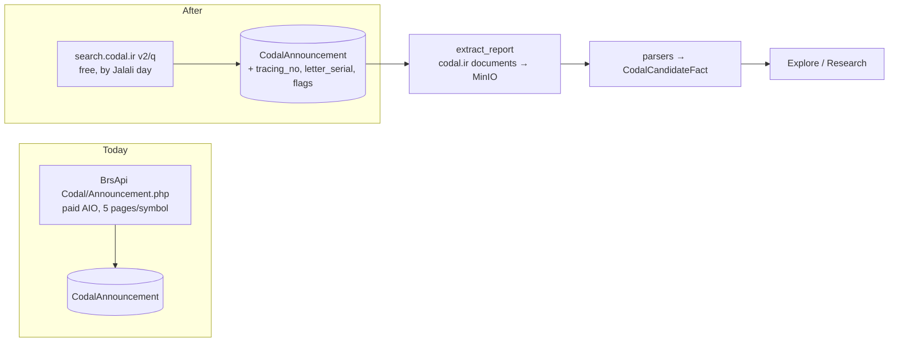

# Codal direct: migration plan (BrsApi → codal.ir)

Status: **proposal, waiting for owner decisions** (§9). Measured 2026-10-05 from the
production VPS (`45.139.10.12`, ParsPack AS60631, Iran). Nothing in this document has
been built or run against production beyond read-only probes and SELECTs.

## 1. What changes, in one paragraph

Today we *discover* Codal filings through BrsApi's `Codal/Announcement.php`. That costs
paid AIO quota (~960 requests a day on average), sees at most the newest 100 filings per
symbol, and never sends a category. The documents themselves already come straight
from codal.ir. The plan moves discovery to codal.ir's own search API as well. Codal then
costs **zero** BrsApi quota, a new filing shows up in **under an hour instead of ~3 days**, history can go back to the start of Codal, and the freed AIO
requests go to the archive backlog that actually needs them: intraday ticks. Parsing
quality (income statement, balance sheet, cash flow) is the next project, not this one.
§8 records what we learned for it.



## 2. The pipeline as it runs today (measured)

| Stage | Where | Measured |
|---|---|---|
| **Discovery delay** | publish time → our `CodalReport.created_at` | Filings published in the last 10 days: **median 79 h** (p75 104 h, p90 128 h, max 185 h); 1 of 1,660 within an hour. A symbol is only re-checked every ~7 days |
| Discovery | `archive._fetch_codal_pages` → `fetchers.fetch_codal_announcements` (AIO, ARCHIVE bucket) | 1,139 states (1,054 verified, 81 never fetched, 4 failing). Re-verified every 7 days, ≤5 pages each. 6,761 AIO requests in 7 days |
| Rows | `CodalAnnouncement` | 107,177 rows, 1,093 symbols, 95 MB. 96% are from 1403–1405; **before 1402 there are 1,002 rows in total** |
| History backfill | `backfill_codal_history` (BrsApi, paid) | **never run**: 0 `CodalHistoryWindow` rows; would need ≥15,930 paid requests |
| Category | `source_category` | **NULL on all 107,177 rows**: BrsApi does not send it |
| Documents | `codal_pipeline.extract_report` → `codal_storage.download_artifact` → MinIO | 220,596 stored (html 106k, pdf 90k, excel 24k; 21.8 GB logical). No BrsApi quota |
| Rejections | `ALLOWED_TYPES` | 85,743 rejected `invalid_content_type`: **82,683 are `Attachment.aspx` HTML listing pages**, fetched once per letter and re-fetched on every rerun |
| "Network" blocks | `CodalBlockedNetwork` | 13,689. **11,904 are `HTTP500@excel.codal.ir`** from the 09-22..25 bulk run (letters with no Excel); ~1,800 real timeouts. Not a geo-block |
| Reports | `CodalReport` | 57,537 needs_review · 45,388 parsed · 4,252 unsupported |
| Facts | `CodalCandidateFact` | 68,422 extracted, **363 reconciled**: the only ones Explore/Research read |
| Orphans | `CodalFact`, `CodalParsedTable`, `CodalSection` | 3.9 GB in Postgres; nothing writes or reads them except Django admin |

## 3. codal.ir measured

### Search API: `https://search.codal.ir/api/search/v2/q`

- **Shape:** `{Total, Page, Letters[20], IsAttacker}`. `Page` is the page *count*. The page size is fixed at 20.
- **Letter fields:** `TracingNo` (int), `Symbol`, `CompanyName`, `Title`, `LetterCode` (`ن-۴۵`), `SentDateTime` / `PublishDateTime` (Persian digits, `YYYY/MM/DD HH:MM:SS`), `HasHtml/HasExcel/HasPdf/HasXbrl/HasAttachment`, `IsEstimate`, `SuperVision{UnderSupervision, AdditionalInfo, Reasons}`, `Url` (`/Reports/Decision.aspx?LetterSerial=…&rt=&let=&ct=&ft=`), `PdfUrl`, `ExcelUrl`, `XbrlUrl`, `AttachmentUrl`, `TedanUrl`.
- **Universe:** market-wide with no filter returns **546,329 letters (27,317 pages)**.
- **Date filter:** works exactly. `FromDate=ToDate=1404/07/02` returned 290 letters, all on that day. A week window returned 1,194. Page `N > Page` returns `Letters: []` with the same `Total`.
- **Validation:** `FromDate=-1` → **400** (`تاریخ وارد شده نامعتبر است`). Omit the parameter instead.
- **Symbol filter:** works. `فولاد` all-time = 862 letters / 44 pages.
- **Ordering:** newest first. Deep offset paging over a live, growing list would shift under us, which is why §5 crawls **by Jalali day**.

### Rate limiting: the binding constraint

- `search.codal.ir` answers **HTTP 429** (`text/html`, body "The custom error module does not recognize this error.") with **no `Retry-After` and no rate headers**. `IsAttacker` never flipped. An F5 web firewall sits in front (`TS…` cookies).
- **Measured behaviour:** it behaves like a **bucket of roughly 17–20 requests** plus a **penalty for knocking while blocked**.
  - Fresh: ~9 requests in ~2 min succeeded.
  - While penalised and retrying every 15 s–3 min: one success per ~6 min.
  - 15 min idle straight after that: 1 success, then 429. The penalty was still running.
  - 10 min idle: **17 successes at 5 s spacing**, then 429.
  - **Escalation:** after the 17-request burst ended in a 429, knocks at +9, +21 and +33 min (one request each) all got 429. The block grows when it is tripped repeatedly.
- **Best-fit model: about 30 requests per rolling 60 minutes, plus a penalty memory after a trip.** It is not exact.
  - Both trips came at roughly the 30th request in the past hour (13:44: ~30; 15:36: ~27).
  - One request every 2 min (30/h) ran 36 min clean, right at the edge.
  - Bursts of 10 every 15 min (40/h) failed on the second burst.
  - After a trip, the block lasted 10 min to 45 min, longer when knocked on.
  - At 15:56 the block lifted for **one** request, and the next one, 3 min later, was 429 again with only ~15 requests in the past hour.
  - **Conclusion: the safe sustained rate is somewhere between 10 and 30 per hour.** It can only be pinned down by running, which is what phase 1 (shadow mode) is for.
- **History depth:** 1375/06/01, 1380/06/01 and 1385/06/01 return 0 letters. 1388/06/01 has 4, 1390 has 15, 1393 has 52, 1396 has 116. Codal's history starts around 1386–1388.
- **Design rule this forces:** never retry a 429 inline. Park the origin and come back after the cooldown. Each premature retry seemed to restart the clock.
- `codal.ir` (documents) kept answering 200 while search was 429, so the two hosts are limited separately.
- **codal.ir also shows a CAPTCHA.** `Decision.aspx` and `Attachment.aspx` returned a 5,520-byte page titled `تأیید کاربر` ("because many reports were viewed, enter the security code") **with HTTP 200 `text/html`**. Our downloader would store that as a valid HTML artifact.
  - 1,000 of the newest stored HTML artifacts and a 600-artifact historical sample were scanned: **0 CAPTCHA pages stored so far**. The worker had fetched nothing in the previous 3 h, but the challenge was **still active at 14:25 UTC**. The page size varies (5,520 / 6,023 bytes), so detection must look for content markers, not size. Fix: draft PR #50 (phase 0).
  - The guard is missing, though, and the volume this plan adds makes it likely. **We do not solve or bypass CAPTCHAs**: the design stays under the limit and parks when challenged.
- **No `robots.txt`** on either host. The terms of use are unverified (open item, §9).

### Documents

- **Excel** (`excel.codal.ir/service/Excel/GetAll/<serial>/0`) is served as `application/ms-excel`, but the body is an **HTML workbook** (`<html xmlns:x=…excel>`). This is why `_valid_magic` must accept HTML for `excel`.
- **PDF** (`DownloadFile.aspx?hs=…&ft=1005&let=…`) is a real `%PDF-1.4`, ~3 s per download.
- **Decision.aspx `var datasource`** and the `sheetId` variants could not be re-sampled today because of the CAPTCHA. The repo's 13 V9 fixtures (`tests/fixtures/codal/`) remain the reference.

### Cross-reference with what we hold

- **Join key:** `LetterSerial` is present in `link` on 107,176 of 107,177 rows and is **unique across the table** (0 duplicates). It's the key that matches direct letters to stored rows.
- **Coverage:** on 1404/07/02 codal.ir has 290 letters. A paged crawl returned **exactly 290 unique `TracingNo`**, so per-day completeness is provable. We hold 201 of them (**69%**). On 1404/07/05 we hold 300; the codal.ir total is _pending_. The full matched/unmatched/duplicate report is phase 2's deliverable.
- **First match run (read-only), 160 letters = the newest 8 pages of 1404/07/05:**
  - **114 matched by `LetterSerial` with 0 disagreements** on symbol, code and publish time.
  - 46 are new to us: **45 from publishers outside our instrument catalog** (funds, unlisted issuers) and **1 for a catalog symbol**. For listed stocks, BrsApi discovery was ~99% complete on this sample.
  - So the direct switch buys speed (§2), history, category data and zero quota. It does not fix a large daily gap for listed stocks.
  - Also on this sample: 17 letters have no `let=` in `Url`; `HasXbrl` is 0 of 160; `HasExcel` 82, `HasAttachment` 79.
- **Codes:** BrsApi `code` is the same `LetterCode` (`ن-67`), already ASCII-folded. `let=` in the URL is the letter type.

## 4. Where the freed BrsApi quota goes

- **AIO has been fully spent since 2026-10-01** (9,850/10,000 a day, ~9.5k of it archive). Codal discovery was **6,761 requests in 7 days**, ~960 a day on average, in bursts of 4,815 on 10-01 and 1,736 on 10-03.
- **Retiring it frees ~10% of the AIO wallet.** `archive_capacity()` hands it out automatically; no fixed allocation has to change.
- **But it would not reach the real backlog by itself.**
  - All four daily-series endpoints are complete: 0 missing rows across 8,756 states. Yet they still take ~9k requests a day in refreshes.
  - **Ticks owe 26,813 sessions across 990 states and average 35 days stale**, and they get `MARKETDATA_TICK_QUOTA_SHARE = 0.25` of each batch.
  - Freed slots land in the "everything else" lane, i.e. more daily refreshes.
- **Proposal:** retire BrsApi Codal and, in the same release, raise the tick share. Rough arithmetic: ticks get ~830 requests a day today (5,779 in 7 days), so the 26,813-session backlog takes ~32 days. With +960 a day, it takes ~15 days.

  ```mermaid
  flowchart LR
    W[AIO 10,000/day] --> L[live reserve]
    W --> AR[archive]
    AR --> D[daily refresh lane<br/>already complete]
    AR --> T[tick lane 25%<br/>26,813 sessions owed]
    AR -. today ~960/day .-> C[Codal discovery ✱ retired]
    C -. freed .-> T
  ```

## 5. Target design

### 5.1 Fetcher: `marketdata/sources/codal_search.py`

- **Location:** it lives in `sources/` (free direct origins, `sources/http.fetch`), *not* `fetchers.py`. `fetchers.py` is the BrsApi client and reserves quota on every call.
- **Interface:** `fetch_letters(day: str, page: int, symbol: str | None = None) -> {total, pages, letters}`.
  - It folds Persian digits, splits `PublishDateTime` into `date_publish` + `time_publish` in the same normalized form `ingest_codal` stores, and parses `LetterSerial` and `let` out of `Url` with `unquote` (a `%3d` and an `=` compare equal).
- **Pacing: adaptive, and never knocks while blocked.**
  - A rolling-hour budget in Redis starts at **12/h**.
  - Each clean hour raises it by 2, up to a ceiling of 24.
  - Any 429 halves it **and** parks the origin for 30 min, doubling up to 6 h. During the park there are no requests at all, not even a probe, because a knock seemed to extend the block.
  - Staying under the limit matters more than raw speed.
  - A **429 parks the origin** with exponential cooldown (start 10 min, ×2, cap 6 h, jittered). It is never retried inline: `http.fetch` currently retries a 429 after 1 s, which §3 shows extends the block.
  - `IsAttacker: true` is treated the same as a 429.
- **Validation:** a response without `Letters`, or with `Total` changing between pages of the same day, raises. It never returns an empty ingest.

### 5.2 Discovery bookkeeping: one row per Jalali day

New model `CodalDiscoveryDay(date, total, pages, letters_seen, verified_complete, last_success_at, next_attempt_at, consecutive_failures, last_error)`, unique on `date`.

- **A day is complete only when** the distinct `TracingNo` count equals `Total`, every letter reads back from Postgres, and `Total` was stable across all its pages.
- **Live lane:** every run re-crawls *today* and the previous 3 days (late publication, corrections).
- **Backfill lane:** with leftover budget, the newest incomplete day walks backwards toward the oldest year codal.ir returns.
- **Re-check:** completed days re-check `Total` with one page-1 request after 7 days, then 30, then 180. A changed `Total` reopens the day.
- **Locking:** `backfill_codal_history`'s advisory lock pattern guards the job. `CodalHistoryWindow` / `codal_history.py` are retired with BrsApi (per-symbol windows do not fit a market-wide day crawl).
- **Budget arithmetic:**
  - At 10–24 requests/h that is **240–575 a day**.
  - The live lane needs ~10–30 pages a day for new letters, plus a few re-checks, and always goes first.
  - **Backfill: 210–545 pages a day → 27,317 pages in ~50–130 days**, newest first. Most letters are recent, so 1403–1405 (~9–10k pages, estimated) lands in the first 3–6 weeks.

### 5.3 Schema (migration `marketdata/00xx_codal_direct`)

- **Columns added to `CodalAnnouncement`** (all nullable or defaulted, so the migration needs no table rewrite):
  - `tracing_no` BigInteger, unique, null
  - `letter_serial` varchar(64), unique, null
  - `letter_type` smallint (from `let=`)
  - `has_html` / `has_excel` / `has_pdf` / `has_xbrl` / `has_attachment` (bool, null)
  - `xbrl_url`
  - `is_estimate`
  - `under_supervision` smallint
  - `source` (`brsapi` | `codal`)
- **Backfill `letter_serial`** on the existing 107,177 rows: parse `link`, falling back to `link_pdf` (`hs=`) and then `link_attachment`. Run it in batches as a data command, not inside the schema migration.
  - The literal-`+` hazard is real: 2,115 links carry `%2b`. Decode with `unquote`, never with `parse_qsl`.
- **Matching a direct letter:**
  1. `letter_serial` first.
  2. Then the old unique key `(symbol, code, date_publish, time_publish)`.
  3. Otherwise insert.
  - On a match it fills `tracing_no` and the flags. It never overwrites `title`, `symbol` or links that differ; it records the disagreement instead.
- **After matching**, `tracing_no` is the canonical identity. The old unique constraint stays, because it still protects BrsApi rows that never match.
- **Storage:** ~0.9 KB a row. All 546k letters ≈ 0.5 GB of Postgres. Documents are separate (§5.5).

### 5.4 Extraction changes, needed because of §3

1. **CAPTCHA guard** in `download_artifact`: a body carrying the `تأیید کاربر` challenge markers raises a new `CodalChallenged`. It is not stored, it parks the `codal.ir` origin with exponential cooldown, and the report stays retryable. *Ships first, independent of discovery.*
2. **Stop fetching `Attachment.aspx` as an artifact.** It is an HTML listing that has been rejected 82,683 times, and it counts toward the CAPTCHA threshold. Real attachment files come from links inside the page, and that is phase 5.
3. **Skip what cannot exist:** `HasExcel=false` means no Excel request, and the same for PDF. This removes the ~12k `HTTP500@excel.codal.ir` class.
4. **Attempt cap** on `BLOCKED_NETWORK` / `FAILED` (for example 8 attempts with backoff), and classify HTTP 4xx/5xx with a response as their own codes instead of "network".
5. **Never re-download a `REJECTED` artifact** with the same URL and parser inputs.

### 5.5 Which documents to download (disk)

- **Measured cost:** 220k artifacts for ~107k letters = 21.8 GB logical. MinIO compresses on write. The on-disk size was not measured: a `du` over the bucket ran past 30 min and was stopped. `STORAGE-POLICY.md` records ~23 GB uncompressed. PDFs (5.5 GB of the total) barely compress.
- **Projection:** pulling every document for all 546k letters would be ~110 GB logical. That doesn't fit a 99 GB disk with 30 GB free, shared by four apps.
- **Proposal:** *discover* everything (rows are cheap) but *download* only for symbols in the instrument catalog (`MarketInstrument` TSE stocks/funds). Prefer HTML (`datasource`) or Excel, and fetch PDF only when neither exists.
- The storage policy is unchanged: nothing already stored is deleted.

### 5.6 Wiring and retirement (the repo's "three switches")

1. **Retire the BrsApi endpoint:** `CODAL_ANNOUNCEMENTS` leaves `STOCK_ENDPOINTS`. Existing states are parked with a reason in `last_error`, not marked complete, so `coverage_report` does not relabel them "live price loop".
2. **Split the flag:** `CODAL_DISCOVERY_SOURCE = codal | brsapi` (default `codal`) for one release, then the BrsApi branch is deleted. `CODAL_ENABLED` keeps gating extraction only.
3. **Beat entry:** `codal-discovery` every 10 min on the `live` queue (cheap; it does nothing while parked).
- New letters still go through `ingest._enqueue_codal_extractions` → `extract_report`. That path is unchanged.
- **Readers to update:**
  - Explore dossier coverage (`explore_api.py:445-500`) reads `ArchiveFetchState(codal_announcements)` and switches to day-coverage.
  - The Ops Codal panel (`admin_telemetry._codal_history_status`).
  - The `Explore.jsx` coverage label.
  - The valuation known-limit `codal_page_cap`, which is deleted because the cap no longer exists.
- **Classification:** `_letter_type` uses the stored `letter_type` (`let=`), which fixes the dead `let\d+` regex. The BrsApi-era rows get it from `link` during the serial backfill.

## 6. Phases (each its own PR, each gated)

| # | Phase | Production effect | Gate to next |
|---|---|---|---|
| 0 | CAPTCHA guard + stop Attachment.aspx + attempt cap | fewer codal.ir hits, no bad artifacts | deployed, 48 h with 0 challenged-and-stored |
| 1 | Fetcher + `CodalDiscoveryDay` + schema; **shadow mode** (crawl, match, write nothing to `CodalAnnouncement`) | search.codal.ir traffic only | cross-reference report (§7) reviewed by owner |
| 2 | Serial backfill + direct writes behind `CODAL_DISCOVERY_SOURCE=codal` | new letters from codal.ir | 7 days: every day since cutover verified complete |
| 3 | Retire BrsApi Codal + raise tick share | ~960 AIO/day moves to ticks | tick backlog trending down |
| 4 | Historical day backfill (newest → oldest) | rows only; downloads restricted per §5.5 | owner approval + disk check per storage policy |
| 5 | Extraction quality (separate plan) | — | — |

## 7. Cross-reference report (phase 1 deliverable)

For each crawled day:
- codal.ir `Total`
- matched by serial, matched by fallback key
- unmatched-ours (BrsApi-only rows: likely deleted or retracted letters, kept and flagged)
- unmatched-theirs (new to us, split into listed-symbol vs other publishers)
- duplicate serials, field disagreements (title, symbol, time)

Rolled up per symbol and per year. 1404/07/02 so far: 290 theirs vs 201 ours.

## 8. Notes for the extraction project (not in scope now)

- **Biggest finding: statement filings never reach the statement parser.**
  - ~18,900 filings whose titles say "financial statements" (`doc_type` `financial_statements` 7,677 + `interim_financials` 11,326) have a **stale `CodalReport.category`**:
    - 14,573 sit under 5 (auditor report);
    - ~4,300 under 10/11;
    - **only ~120 under 2 (statements)**, the only category that runs `parse_income_statement`.
  - The current `classify_announcement` returns 2 for them (checked on production rows, `ن-10`, `let=6`). The stored value came from an older classifier (2026-09-22/24) and was never refreshed. That is why there are only **36 reconciled income facts across 6 filings**.
  - The fix is offline: no codal.ir requests and no quota, because every document is already in MinIO.
    1. Re-classify existing reports.
    2. Re-run the statement parser. `reparse_income_statements` covers `financial_statements` but **not `interim_financials`** (11k).
  - It writes to production, so it needs approval. Do it first when the extraction project starts.
- **Where facts stand:** 68,422 extracted vs 363 reconciled (327 monthly sales + 36 income), covering 283 symbols. Extracted families: portfolio 23k, sales 22k, assembly 11k, financial 5.7k, production 4.4k.
- **No reason codes:** `parse_income_statement` and `parse_balance_sheet` return `[]` with no reason. Category-2 reports then fall back to keyword facts and are marked PARSED.
- **Narrow parser coverage:** only V9 income/balance templates in million Rial, current column only. No cash flow, no bank/insurance/fund templates, no PDF OCR.
- **Balance sheets never run in production:** they're parsed only by `backfill_balance_sheets --fetch`, which has never run there and ignores `CODAL_ENABLED`.
- **The `+` bug:** `balance_sheet_url` decodes with `parse_qsl`, which turns a literal `+` into a space.
- **Classification:** `let\d+` never matches `&let=6`, and with `re.I` it can match inside a base64 serial.
- **Upside of direct discovery:** `HasXbrl` / `XbrlUrl` are exposed directly. XBRL, where present, may beat HTML scraping for statements, which makes it worth a measured look first.
- **Readers of parsed facts:** only Explore, Research and `research_coverage`. Nothing in valuation, returns or optimization reads them.

## 9. Decisions needed (asked one at a time)

1. **Discovery scope:** crawl market-wide (all 546k letters, every publisher) or only symbols in our catalog? *Recommendation: market-wide.* Rows are cheap, per-day completeness is only provable market-wide, and downloads are scoped separately.
2. **Shadow before cutover** (phase 1 writes nothing), or write directly from day one? *Recommendation: shadow, ~1 week.*
3. **Freed quota:** raise the tick share, and to what? *Recommendation: 0.25 → 0.35 in the same release as phase 3, re-measured after 7 days.*
4. **Document scope** for the historical backfill (§5.5). *Recommendation: catalog symbols only; HTML/Excel first, PDF only as fallback.*
5. **Terms of use:** codal.ir publishes no robots.txt. Confirm we're comfortable with automated reads at the measured polite rate.
6. **Orphan tables:** `CodalFact` / `CodalParsedTable` / `CodalSection` (3.9 GB). Keep as-is per the storage policy, or approve a separate decision. *No action proposed here.*
